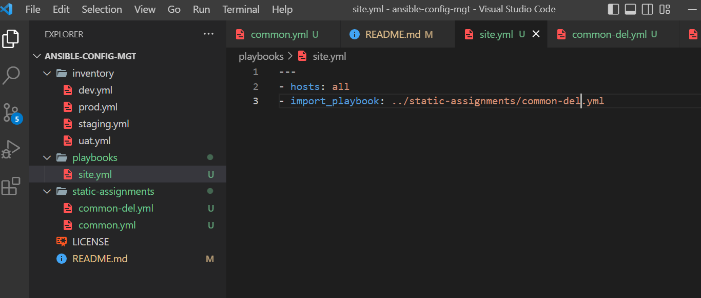
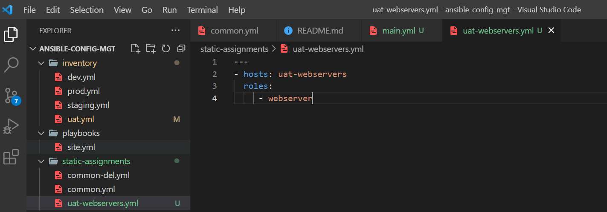
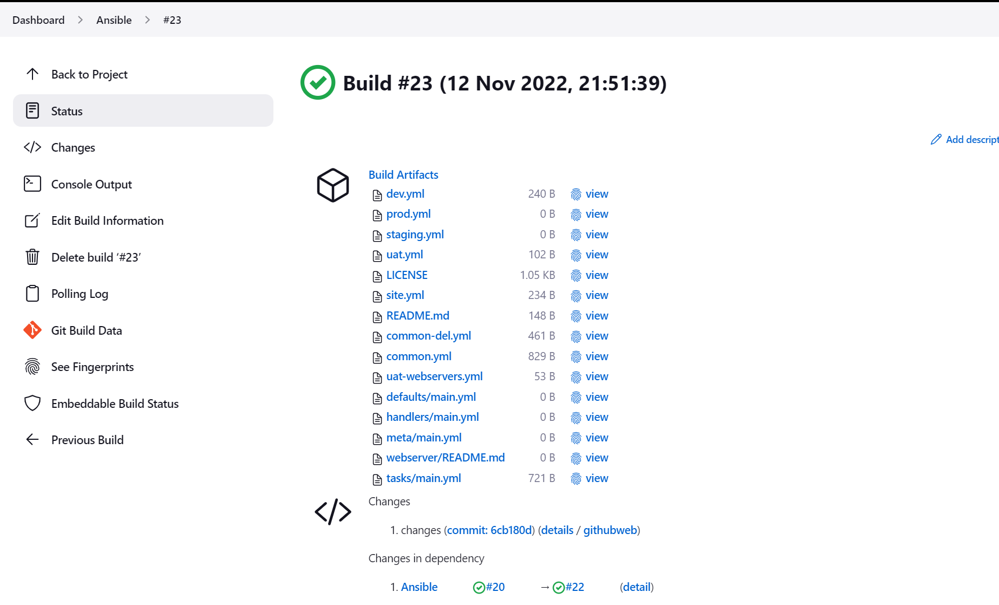
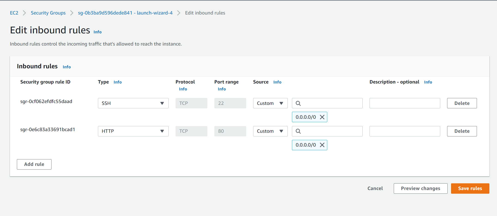
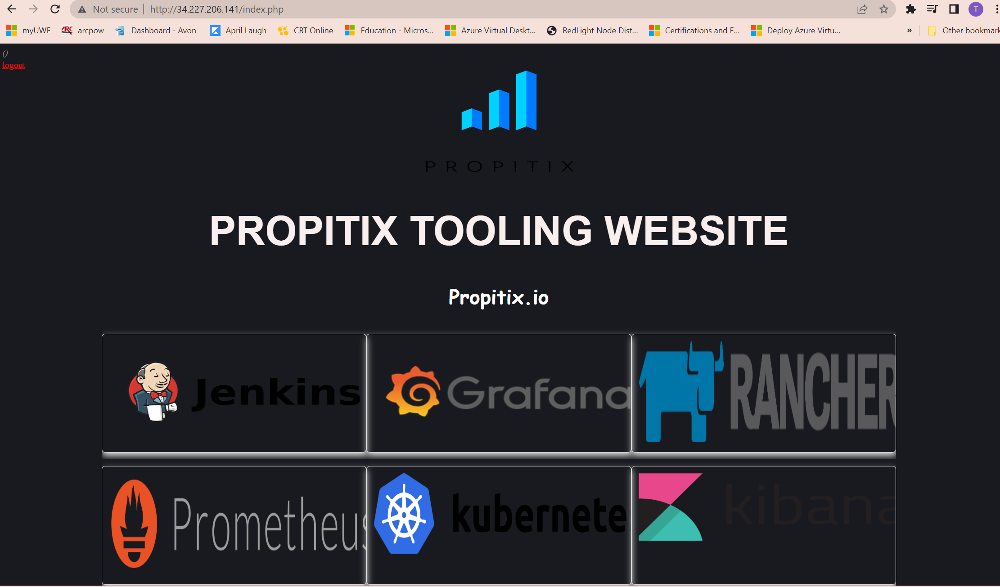

## **Step 1 – Jenkins job enhancement** ##

>Note: Every new change in the codes creates a separate directory which is not very convenient when we want to run some commands from one place. Besides, it consumes space on Jenkins serves with each subsequent change. I will enhance it by introducing a new Jenkins project/job – we will require Copy Artifact plugin

Go to your Jenkins-Ansible server and create a new directory called ansible-config-artifact – we will store there all artifacts after each build.
```
sudo mkdir /home/ubuntu/ansible-config-artifact
```


Change permissions to this directory, so Jenkins could save files there –
```
chmod -R 0777 /home/ubuntu/ansible-config-artifact
```


Go to Jenkins web console -> Manage Jenkins -> Manage Plugins -> on Available tab search for Copy Artifact and install this plugin without restarting Jenkins


Create a new Freestyle project (you have done it in Project 9) and name it save_artifacts.


This project will be triggered by completion of existing ansible project. Configure it by enabling `Discard old builds`
Type 3 in `Max # of builds to keep` box, enable `Build after other projects are built` under Build Triggers and type 'ansible' under `Projects to watch` box


>The main idea of save_artifacts project is to save artifacts into /home/ubuntu/ansible-config-artifact directory. To achieve this, 

create a Build step and choose Copy artifacts from other project, specify ansible as a source project and /home/ubuntu/ansible-config-artifact as a target directory.


Test your set up by making some change in README.MD file inside your ansible-config-mgt repository (right inside master branch).


>If both Jenkins jobs have completed one after another – you shall see your files inside /home/ubuntu/ansible-config-artifact directory and it will be updated with every commit to your master branch.


## **Step 2 – Refactor Ansible code by importing other playbooks into site.yml** ##

Before starting to refactor the codes, we need to create a new branch and name it refactor.
```
git branch refactor
git checkout refactor
```


Within playbooks folder, create a new file and name it site.yml – This file will now be considered as an entry point into the entire infrastructure configuration. Other playbooks will be included here as a reference. In other words, site.yml will become a parent to all other playbooks that will be developed. 


Create a new folder in root of the repository and name it static-assignments. The static-assignments folder is where all other children playbooks will be stored.


Move common.yml file into the newly created static-assignments folder.


Inside site.yml file, import common.yml playbook.
```
---
- hosts: all
- import_playbook: ../static-assignments/common.yml
```
>The code above uses built in import_playbook Ansible module.


The folder structure should look like this shown on the screenshot:


Create another playbook under static-assignments and name it common-del.yml. In this playbook, configure deletion of wireshark utility.


Update site.yml with - import_playbook: ../static-assignments/common-del.yml instead of common.yml and run it against dev servers:


>Update, commit and push code to origin refactor to initiate a pull request that trigger the webhook for a new build.

Verify dynamic build in Jenkins


Check to see if you are able to ping all the servers
```
ansible all -m ping
```


Run ansible-playbook command
```
cd /var/lib/jenkins/jobs/Ansible/builds/22/archive

ansible-playbook -i inventory/dev.yml playbooks/site.yml
```


Verify that wireshark is deleted on all the servers by running:
```
which wireshark
wireshark --version
```


## **Step 3 – Configure UAT Webservers with a role ‘Webserver’** ##

Launch 2 fresh EC2 instances using RHEL 8 image, we will use them as our uat servers, so give them names accordingly – Web1-UAT and Web2-UAT.


To create a role, you must create a directory called webserver/, relative to the playbook file or in /etc/ansible/ directory.

The directory/files structure can be created manually or we can use an Ansible utility called ansible-galaxy inside ansible-config-mgt/roles directory (you need to create roles directory upfront)

```
mkdir roles
cd roles
ansible-galaxy init webserver
```
I used the first option to create the role


Update your inventory ansible-config-mgt/inventory/uat.yml file with IP addresses of your 2 UAT Web servers

```
[uat-webservers]
<Web1-UAT-Server-Private-IP-Address> ansible_ssh_user='ec2-user' 

<Web2-UAT-Server-Private-IP-Address> ansible_ssh_user='ec2-user' 
```


In /etc/ansible/ansible.cfg file uncomment roles_path string and provide a full path to your roles directory roles_path    = /home/ubuntu/ansible-config-mgt/roles, so Ansible could know where to find configured roles.
```
sudo vi /etc/ansible/ansible.cfg
```


Go into tasks directory, and within the main.yml file, start writing configuration tasks to do the following:

- Install and configure Apache (httpd service)
- Clone Tooling website from GitHub https://github.com/<your-name>/tooling.git.
- Ensure the tooling website code is deployed to /var/www/html on each of 2 UAT Web servers.
- Make sure httpd service is started

The main.yml will consist of following tasks:

```
---
- name: install apache
  become: true
  ansible.builtin.yum:
    name: "httpd"
    state: present

- name: install git
  become: true
  ansible.builtin.yum:
    name: "git"
    state: present

- name: clone a repo
  become: true
  ansible.builtin.git:
    repo: https://github.com/<your-name>/tooling.git
    dest: /var/www/html
    force: yes

- name: copy html content to one level up
  become: true
  command: cp -r /var/www/html/html/ /var/www/

- name: Start service httpd, if not started
  become: true
  ansible.builtin.service:
    name: httpd
    state: started

- name: recursively remove /var/www/html/html/ directory
  become: true
  ansible.builtin.file:
    path: /var/www/html/html
    state: absent
```


## **Step 4 – Reference ‘Webserver’ role** ##

Within the static-assignments folder, create a new assignment for uat-webservers uat-webservers.yml. This is where you will reference the role.


>Remember that the entry point to our ansible configuration is the site.yml file. Therefore, you need to refer your uat-webservers.yml role inside site.yml.

The site.yml needs to be updated with the following code:
```
---
- hosts: uat-webservers
- import_playbook: ../static-assignments/uat-webservers.yml
```
Comment the previous playbook code as it is not needed


## **Step 5 – Commit & Test** ##

Commit your changes, create a Pull Request and merge them to master branch, make sure webhook triggered two consequent Jenkins jobs, they ran successfully and copied all the files to your Jenkins-Ansible server into /home/ubuntu/ansible-config-artifact/ directory.


Verify build on Jenkins Anisble job


Verify build on Jenkins save_artifacts


Now let's run the playbook
```
cd /var/lib/jenkins/jobs/Ansible/builds/22/archive

ansible-playbook -i inventory/uat.yml playbooks/site.yml
```


To view the web application on the browser, open port 80 for http traffic in the security group
>Create an inbound rule for Web1-UAT and Web2-UAT and add HTTP with port 80


You should be able to see both of your UAT Web servers configured and you can try to reach them from your browser:

```
http://<Web1-UAT-Server-Public-IP-or-Public-DNS-Name>/index.php

http://<Web2-UAT-Server-Public-IP-or-Public-DNS-Name>/index.php
```




